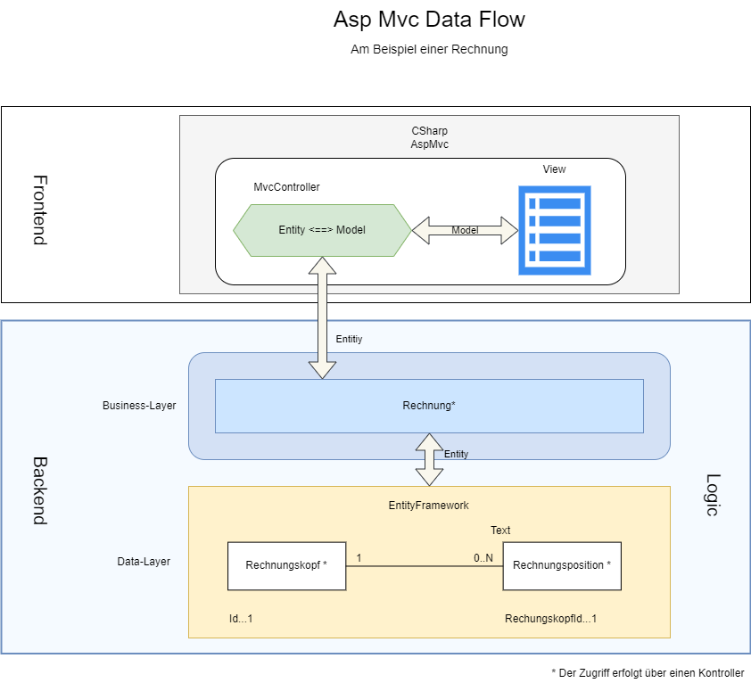

AspMvc-WebApp
=============

Mit dem AspMvc-Framework können sehr einfach Web-Anwendungen erstellt werden. Web-Anwendungen haben den Vorteil, dass diese Anwendungen ortsungebunden und geräteunabhängig ausgeführt werden können. Einzig und allein ein Zugang zum Internet ist dafür erforderlich. Diese Art von Anwendung, ist aus unserem Alltag nicht mehr wegzudenken.

Der AspMvc-Framework ist ein Teil vom DotNet-Core-Framework und kann mit der Programmiersprache CSharp angepasst werden. Dies hat den Vorteil, dass diese Anwendung direkt mit dem Backend-System kommunizieren kann. Es ist also kein RESTful-Service für den Zugriff auf die Logik erforderlich. 

# Funktionsweise der AspMvc-Anwendung

Wenn eine Url in den Browser eingegeben wird, dann wird diese vom Framework entsprechend ausgwertet und an die Komponenten der Anwendung weitergeleitet. Die Auflösung der Url erfolgt in:

- Server
- Kontroller
- Aktion (ohne und mit Parameter)

Zum Beispiel wird die Url https://musicstorelight.com/genres/create wie folgt aufgelöst:

- https://musicstorelight
- genres
- create

Der Server-Teil ist die Adresse des Host-Servers und ist für den AspMvc-Framework ohne Bedeutung. Im zweiten Teil ist der Kontroller adressiert. Diese Information weist den Framework an, für die Anfrage den Kontroller ***GenresController*** zu verwenden. Dieser Kontroller befindet sich im Abschnitt ***Controllers*** und muss nach der Nameskonvention mit **Controller** enden. Der dritte und letzte Teil, die Aktion, zeigt den Framework an, welche Methode für die Anfrage zuständig ist. Im Beispiel ist das die **Create()-Methode** des Kontrollers ***GenresController***.

 ## Verbindung Aktion mit der Ansicht  

Mit der **Aktion** ist eine **Ansicht** assoziiert. Diese Assoziation erfolgt über die Rückgabe durch ***'return View(model)'*** in der Aktionsmethode. Dabei muss folgende Namenskonvention beachtet werden.  
Der Framework sucht zuerst im Ordner **Views** nach einem Unterordner mit dem Namen des Kontrollers. Also nach einem Unterordner mit dem Namen ***Genres***. Gibt es einen solchen Unterordner, dann sucht der Framework nach einer Ansicht (View) mit dem Namen der Aktion. Gibt es in diesem Ordner eine Ansicht mit dem Namen ***Create.cshtml***, dann wird diese ausgewählt und an die Render-Engine zurück geliefert.  
Findet der Framework keine Ansicht mit dem Namen ***Create.cshtml***, dann sucht der Framework im Ordner ***'Shared'*** weiter nch dieser Ansicht. Findet der Framework keine Ansicht mit diesem Namen, dann reagiert dieser mit einer Fehlermeldung.

> HINWEIS: Es ist auch möglich, einen anderen Namen für die Ansicht zu verwenden. Allerdings muss dieser in der Rückgabe ***'return View("MyCreate", model)'*** angegeben werden.

## Ablauf und Interaktion

In der nachfolgenden Skizze ist der Ablauf schematisch dargestellt:  
 

