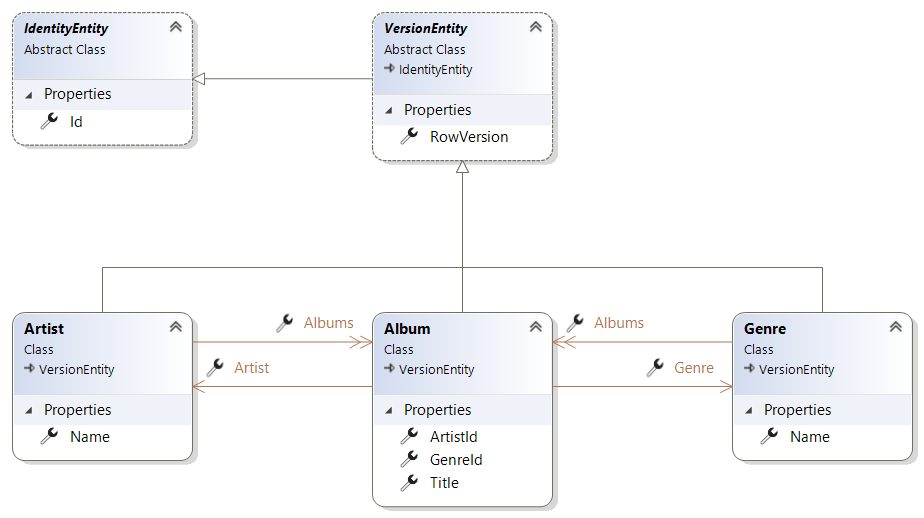

  
# QTMusicStoreLight  
  
Dieses Projekt ist mit der Vorlage ***QuickTemplate*** erstellt worden und wird nun Schritt für Schritt vom ***'Backend'*** bis zum ***'Frontend'*** entwickelt - also eine ***'Full Stack Application'***. Die Beschreibung für die Erstellung diese Projektbasis ist auf [Github-QuickTemplate](https://github.com/leoggehrer/CSSoftwareEngineering-QuickTemplate) dokumentiert.   
  
# Inhaltsverzeichnis  
1. [Projektbeschreibung](#Projektbeschreibung)  
   1. [Definition von Artist](#definition-von-artist)  
   2. [Definition von Album](#definition-von-album)  
   3. [Definition von Genre](#definition-von-genre)  
2. [Erstellen des Backends](#erstellen-des-backends)  
   1. [Erstellen der Entitäten](#erstellen-der-entitaeten)  
   2. [Erstellen der Kontroller](#erstellen-der-kontroller)  
   3. [Erstellen der Datenbank](#erstellen-der-datenbank)  
   4. [Importieren von Daten](#importieren-von-daten)  
3. [Erstellen der AspMvc-Anwendung](#erstellen-der-aspmvc-anwendung)  
   1. [Erstellen der AspMvc-Models](#erstellen-der-aspmvc-models)  
   2. [Erstellen der AspMvc-Kontrollers](#erstellen-der-aspmvc-kontrollers)  
   3. [Erstellen der Ansichten](#erstellen-der-ansichten)  
4. [Erstellen der RESTful-Services](#erstellen-der-restful-services)  
   1. [Erstellen der WebApi-Models](#erstellen-der-webapi-models)  
   2. [Erstellen der WebApi-Kontrollers](#erstellen-der-webapi-kontrollers)  
   3. [Eintragen der Logik-Kontrollers in die Dependency Injection](#eintragen-der-logik-kontroller-in-die-dependency-injection)   
  
# Projektbeschreibung  
  
***QTMusicStoreLight*** ist eine einfache Anwendung zur Verwaltung von Musik-Daten. Damit sollen Künstler (Artists) und deren Alben in einer Datenbank gespeichert werden und bei Bedarf wieder abgerufen werden können. Die Bearbeitung der Daten soll über eine Web-Anwendung als auch über eine Desktop Anwendung ermöglicht werden. Das Datenmodell ist in der folgenden Abbildung skizziert.  
  
```txt  
                +-------------+                 +-------------+  
                |             |                 |             |  
       +----- n +    Album    + n ----------- 1 +    Genre    |  
       |        |             |                 |             |   
       |        +-------------+                 +-------------+  
       |  
       1  
+------+------+  
|             |  
|   Artist    |  
|             |  
+------+------+  
  
```  
  
Ein Künstler kann beliebig viele Alben zugeordnet haben und das Album ist mit einer Musikrichtung (Genre) verbunden. Das Datenmodell für den **MusicStoreLight** ist wie folgt definiert:  
  
  
## Definition von ***Artist***  
  
| Name | Type | MaxLength | Nullable |Unique|  
|------|------|-----------|----------|------|  
| Id | int |---|---|---|  
| RowVersion | byte[] |---|No|---|  
| Name | String | 128 | No |Yes|  
  
## Definition von ***Album***  
  
| Name | Type | MaxLength | Nullable |Unique|  
|------|------|-----------|----------|------|  
| Id | int |---|---|---|  
| RowVersion | byte[] |---|No|---|  
| ArtistId | int |---|---|---|  
| GenreId | int |---|---|---|  
| Title | String | 256 | No |Yes|  
  
## Definition von ***Genre***  
  
| Name | Type | MaxLength | Nullable |Unique|  
|------|------|-----------|----------|------|  
| Id | int |---|---|---|  
| RowVersion | byte[] |---|No|---|  
| Name | String | 128 | No |Yes|  
  
# Erstellen des Backends   
  
Das Backend-System bildet das Grundsystem der Anwendung und beinhaltet die Daten- und die Logik-Schicht.   
   
## Erstellen der Entitäten<a name="erstellen-der-entitaeten"/>  
  
Die Entitäten werden im Projekt ***QTMusicStoreLight.Logic*** im Ordner ***Entities*** definiert. Nachdem für die Entitäten als Zugriffsstrategie ***Cuncurrency Optimistic*** verwendet wird (RowVersion ist definiert), werden die Entitäten vom bereits definierten ***VersionObject*** abgeleitet.  
  
Die Implementierung der Entität ***Artist***:  
  
```csharp  
namespace QTMusicStoreLight.Logic.Entities  
{  
    [Table("Artists", Schema = "App")]  
    [Index(nameof(Name), IsUnique = true)]  
    public class Artist : VersionEntity  
    {  
        [Required]  
        [MaxLength(128)]  
        public string Name { get; set; } = String.Empty;  
  
        // Navigation properties  
        public List<Album> Albums { get; set; } = new();  
    }  
}  
```  
  
Die Implementierung der Entität ***Genre***:  
  
```csharp  
namespace QTMusicStoreLight.Logic.Entities  
{  
    [Table("Genres", Schema = "App")]  
    [Index(nameof(Name), IsUnique = true)]  
    public class Genre : VersionEntity  
    {  
        [Required]  
        [MaxLength(128)]  
        public string Name { get; set; } = String.Empty;  
  
        // Navigation properties  
        public List<Album> Albums { get; set; } = new();  
    }  
}  
```  
  
Die Implementierung der Entität ***Album***:  
  
```csharp  
namespace QTMusicStoreLight.Logic.Entities  
{  
    [Table("Albums", Schema = "App")]  
    [Index(nameof(Title), IsUnique = true)]  
    public class Album : VersionEntity  
    {  
        public int ArtistId { get; set; }  
        public int GenreId { get; set; }  
        [Required]  
        [MaxLength(256)]  
        public string Title { get; set; } = String.Empty;  
  
        // Navigation properties  
        public Artist? Artist { get; set; }  
        public Genre? Genre { get; set; }  
    }  
}  
```  
  
Das Datenmodell ist wie nachfolgend dargestellt in ein Objektmodell transformiert worden:  
  
   
  
## Definition vom Datenbank-Kontext  
  
Nachdem die Entitäten definiert sind, wird nun der Datenbank-Kontext für die Anwendung fertiggesetllt. Aus der Vorlage ***QuickTemplate*** ist der vordefinierte Datenbank-Kontext ***'ProjectDbContext'*** kopiert worden. Diese beinhaltet bereits eine Standard-Implementierung für den generischen Kontroller ***'GenericController&lt;E&gt;'*** und ist als eine **'partielle Klasse'** ausgeführt. Damit diese Klasse angepasst werden kann, wird eine weitere **'partielle Klasse'** zur Klasse ***'ProjectDbContext'*** erstellt. Dazu wird eine Datei mit dem Namen ***'ProjectDbContextExt.cs'*** erstellt. Die Erweiterung ist nachfolgend definiert:  
  
```csharp  
using QTMusicStoreLight.Logic.Entities;  
  
namespace QTMusicStoreLight.Logic.DataContext  
{  
    partial class ProjectDbContext  
    {  
        public DbSet<Artist>? ArtistSet { get; set; }  
        public DbSet<Album>? AlbumSet { get; set; }  
        public DbSet<Genre>? GenreSet { get; set; }  
  
        partial void GetDbSet<E>(ref DbSet<E>? dbSet, ref bool handled) where E : IdentityEntity  
        {  
            if (typeof(E) == typeof(Artist))  
            {  
                handled = true;  
                dbSet = ArtistSet as DbSet<E>;  
            }  
            else if (typeof(E) == typeof(Album))  
            {  
                handled = true;  
                dbSet = AlbumSet as DbSet<E>;  
            }  
            else if ((typeof(E) == typeof(Genre)))  
            {  
                handled = true;  
                dbSet = GenreSet as DbSet<E>;  
            }  
        }  
    }  
}  
```  
  
Wie aus der obigen Implementierung ersichtlich ist, werden für die entsprechenden Entitäten die ***'DbSet&lt;E&gt;'*** definiert. Zus�tzlich wird die partielle Methode ***'GetDbSet&lt;E&gt;(...)'*** definiert. über diese Methode greift der ***'GenericController&lt;E&gt;'*** auf den konkreten ***'DbSet&lt;E&gt;'*** zu.  
  
## Erstellen der Kontroller  
  
Der generische Kontroller ***'GenericController&lt;E&gt;'*** implementiert bereits die ***'CRUD'*** Funktionen für eine Entität. Um diese Funktionen für jede Entität zur Verf�gung zu stellen, muss für jede Entität ein eigener Kontroller angelegt werden. Die Kontroller werden im Projekt ***QTMusicStoreLight.Logic*** im Ordner ***Controllers*** definiert.  
  
### Kontroller für die Entität *Artist* erstellen  
  
```csharp  
namespace QTMusicStoreLight.Logic.Controllers  
{  
    public sealed partial class ArtistsController : GenericController<Entities.Artist>  
    {  
        public ArtistsController() : base()  
        {  
        }  
  
        public ArtistsController(ControllerObject other) : base(other)  
        {  
        }  
    }  
}  
```  
  
### Kontroller für die Entität *Album* erstellen  
  
```csharp  
namespace QTMusicStoreLight.Logic.Controllers  
{  
    public sealed partial class AlbumsController : GenericController<Entities.Album>  
    {  
        public AlbumsController() : base()  
        {  
        }  
  
        public AlbumsController(ControllerObject other) : base(other)  
        {  
        }  
    }  
}  
```  
  
### Kontroller für die Entität *Genre* erstellen  
  
```csharp  
namespace QTMusicStoreLight.Logic.Controllers  
{  
    public sealed partial class GenresController : GenericController<Entities.Genre>  
    {  
        public GenresController() : base()  
        {  
        }  
  
        public GenresController(ControllerObject other) : base(other)  
        {  
        }  
    }  
}  
```  
  
> **ACHTUNG:**  Die konkreten Kontroller werden mit dem Schlüsselwort ***'sealed'*** spezifiziert. Die Erklärung folgt zu einem späteren Zeitpunkt.  
  
## Erstellen der Datenbank  
  
Dieser Abschnitt erl�utert die Erstellung der Datenbank.  
  
**Notwendige Voraussetzungen:**  
* Die gesamte Projektmappe muss fehlerfrei übersetzt werden können.  
Die Verbindungszeichenfolge kann im Projekt **QTMusicStoreLight.ConApp** in der Datei **appsettings.Development.json** angepasst werden.  
* Als Startprojekt muss das Projekt **QTMusicStoreLight.ConApp** eingestellt sein.  
* In der **Package Manager Console** muss das **Default projekt: QTMusicStoreLight.Logic** ausgewählt sein.  
  
**Wichtige Kommandos:**  
  
> PM> add-migration InitDb  
  
...diese Kommando erzeugt eine Migration mit dem Namen 'InitDb'.  
  
> PM> update-database  
  
...diese Kommando f�hrt die Migration aus und erzeugt die Datenbank.  
  
## Importieren von Daten  
  
Der Import wird im Projekt **QTMusicStoreLight.ConApp** in der Datei **Program.cs** implementiert. Zu diesem Zweck werden die Daten, im csv-Format, vom [GitHub-MusicStoreDaten](https://github.com/leoggehrer/Data-MusicStore) heruntergeladen und im Ordner **CsvData** abgelegt. In den Eigenschaften der csv-Dateien wird die Eigenschaft **Copy to Output Directory** auf **Copy if newer** eingestellt. Mit dieser Einstellung müssen keine Pfade angegeben werden weil die Dateien in das Ausführungsverzeichnis kopiert werden. Nachfolgend ist der Programm-Code für den Import angegeben:  
  
```csharp  
namespace QTMusicStoreLight.ConApp  
{  
    partial class Program  
    {  
        static partial void AfterRun()  
        {  
            var csvGenres = File.ReadAllLines("CsvData/Genre.csv")  
                             .Skip(1)  
                             .Select(l => l.Split(";"))  
                             .Select(d => new { id = d[0], Entity = new Logic.Entities.Genre { Name = d[1] } });  
            var csvArtists = File.ReadAllLines("CsvData/Artist.csv")  
                             .Skip(1)  
                             .Select(l => l.Split(";"))  
                             .Select(d => new  
                             {  
                                 id = d[0],  
                                 Entity = new Logic.Entities.Artist  
                                 {  
                                     Name = d[1],  
                                 }  
                             });  
            var csvAlbums = File.ReadAllLines("CsvData/AlbumWithGenre.csv")  
                             .Skip(1)  
                             .Select(l => l.Split(";"))  
                             .Select(d => new  
                             {  
                                 id = d[0],  
                                 ArtistId = d[2],  
                                 GenreId = d[3],  
                                 Entity = new Logic.Entities.Album  
                                 {  
                                     Title = d[1],  
                                 }  
                             });  
                var artists = csvArtists.Select(e => e.Entity).ToArray();  
                var genres = csvGenres.Select(e => e.Entity).ToArray();  
                var albums = new List<Logic.Entities.Album>();  
  
                foreach (var item in csvAlbums)  
                {  
                    var genIdx = csvGenres.IndexOf(e => e.id == item.GenreId);  
                    var artIdx = csvArtists.IndexOf(e => e.id == item.ArtistId);  
  
                    item.Entity.Genre = genres[genIdx];  
                    item.Entity.Artist = artists[artIdx];  
                    albums.Add(item.Entity);  
                }  
  
            Task.Run(async () =>  
            {  
                using var albumsCtrl = new Logic.Controllers.AlbumsController();  
  
                await albumsCtrl.InsertAsync(albums);  
                await albumsCtrl.SaveChangesAsync();  
            }).Wait();  
        }  
    }  
}  
```  
  
In der Zeile ***await albumsCtrl.InsertAsync(albums);*** werden die Objekte in den Datenbank-Kontext übertragen. Mit der Anweisung ***await albumsCtrl.SaveChangesAsync();*** werden die Daten in die Datenbank eingetragen. Alle referenzierten Objekte (z.B.: Album -> Artist) werden ebenfalls vom Kontroller in die Datenbank übermittelt.  
  
## Erstellen der AspMvc-Anwendung  
  
### Erstellen der AspMvc-Models  
  
für die Umsetzung der AspMvc-Anwendung ist die Erstellung von Models erforderlich. Diese Models sind die Daten-Transfer-Objekte (DTO's) für die AspMvc-Anwendung vom Kontroller zur Ansicht und umgekehrt. Diese DTO's befinden sich im Ordner **Models** der Amwendung.  
  
Die Implementierung des Models ***Artist***:  
  
```csharp  
using System.ComponentModel.DataAnnotations;  
  
namespace QTMusicStoreLight.AspMvc.Models  
{  
    public class Artist : VersionModel  
    {  
        [Required]  
        [MaxLength(128)]  
        public string Name { get; set; } = string.Empty;  
    }  
}  
```  
  
Die Implementierung des Models ***Genre***:  
  
```csharp  
using System.ComponentModel.DataAnnotations;  
  
namespace QTMusicStoreLight.AspMvc.Models  
{  
    public class Genre : VersionModel  
    {  
        [Required]  
        [MaxLength(128)]  
        public string Name { get; set; } = String.Empty;  
    }  
}  
```  
  
Die Implementierung des Models ***Album***:  
  
```csharp  
using System.ComponentModel.DataAnnotations;  
  
namespace QTMusicStoreLight.AspMvc.Models  
{  
    public class Album : VersionModel  
    {  
        public int ArtistId { get; set; }  
        public int GenreId { get; set; }  
        [Required]  
        [MaxLength(256)]  
        public string Title { get; set; } = string.Empty;  
  
        public string ArtistName { get; set; } = string.Empty;  
        public string GenreName { get; set; } = string.Empty;  
  
        public Logic.Entities.Genre[]? Genres { get; set; }  
        public Logic.Entities.Artist[]? Artists { get; set; }  
    }  
}  
```  
  
> **HINWEIS:** Die zusätzlichen Eigenschaften *ArtistName* und *GenreName* dienen zur Anzeige in der Übersicht (Liste). Die Eigenschaften *Genres* und *Artist* werden in der Ansicht *Create* und *Edit* für die Zuordnung benötigt.  
  
### Erstellen der AspMvc-Kontrollers  
  
### Kontroller *Artist* erstellen  
  
```csharp  
#nullable disable  
using Microsoft.AspNetCore.Mvc;  
  
namespace QTMusicStoreLight.AspMvc.Controllers  
{  
    public class ArtistsController : Controller  
    {  
        private readonly Logic.Controllers.ArtistsController controller;  
  
        public ArtistsController()  
        {  
            controller = new Logic.Controllers.ArtistsController();  
        }  
  
        private static Models.Artist ToModel(Logic.Entities.Artist entity)  
        {  
            var result = new Models.Artist();  
  
            result.CopyFrom(entity);  
            return result;  
        }  
        private static Logic.Entities.Artist ToEntity(Models.Artist model)  
        {  
            var result = new Logic.Entities.Artist();  
  
            result.CopyFrom(model);  
            return result;  
        }  
  
        // GET: Albums  
        public async Task<IActionResult> Index()  
        {  
            var entities = await controller.GetAllAsync();  
  
            return View(entities.Select(e => ToModel(e)));  
        }  
  
        // GET: Albums/Details/5  
        public async Task<IActionResult> Details(int? id)  
        {  
            if (id == null)  
            {  
                return NotFound();  
            }  
  
            var entity = await controller.GetByIdAsync(id.Value);  
  
            if (entity == null)  
            {  
                return NotFound();  
            }  
            return View(ToModel(entity));  
        }  
  
        // GET: Albums/Create  
        public IActionResult Create()  
        {  
            return View();  
        }  
  
        // POST: Albums/Create  
        // To protect from overposting attacks, enable the specific properties you want to bind to.  
        // For more details, see http://go.microsoft.com/fwlink/?LinkId=317598.  
        [HttpPost]  
        [ValidateAntiForgeryToken]  
        public async Task<IActionResult> Create([Bind("Name")] Models.Artist model)  
        {  
            if (ModelState.IsValid)  
            {  
                try  
                {  
                    await controller.InsertAsync(ToEntity(model));  
                    await controller.SaveChangesAsync();  
                    return RedirectToAction(nameof(Index));  
                }  
                catch (Exception ex)  
                {  
                    ViewBag.Error = ex.Message;  
  
                    if (ex.InnerException != null)  
                    {  
                        ViewBag.Error = ex.InnerException.Message;  
                    }  
                }  
            }  
            return View(model);  
        }  
  
        // GET: Albums/Edit/5  
        public async Task<IActionResult> Edit(int? id)  
        {  
            if (id == null)  
            {  
                return NotFound();  
            }  
  
            var entity = await controller.GetByIdAsync(id.Value);  
  
            if (entity == null)  
            {  
                return NotFound();  
            }  
            return View(ToModel(entity));  
        }  
  
        // POST: Albums/Edit/5  
        // To protect from overposting attacks, enable the specific properties you want to bind to.  
        // For more details, see http://go.microsoft.com/fwlink/?LinkId=317598.  
        [HttpPost]  
        [ValidateAntiForgeryToken]  
        public async Task<IActionResult> Edit(int id, [Bind("Name")] Models.Artist model)  
        {  
            var entity = await controller.GetByIdAsync(id);  
  
            if (entity == null)  
            {  
                return NotFound();  
            }  
  
            entity.Name = model.Name;  
  
            if (ModelState.IsValid)  
            {  
                try  
                {  
                    await controller.UpdateAsync(entity);  
                    await controller.SaveChangesAsync();  
                }  
                catch (Exception ex)  
                {  
                    ViewBag.Error = ex.Message;  
  
                    if (ex.InnerException != null)  
                    {  
                        ViewBag.Error = ex.InnerException.Message;  
                    }  
                }  
                return RedirectToAction(nameof(Index));  
            }  
            return View(model);  
        }  
  
        // GET: Albums/Delete/5  
        public async Task<IActionResult> Delete(int? id)  
        {  
            if (id == null)  
            {  
                return NotFound();  
            }  
  
            var entity = await controller.GetByIdAsync(id.Value);  
  
            if (entity == null)  
            {  
                return NotFound();  
            }  
            return View(entity);  
        }  
  
        // POST: Albums/Delete/5  
        [HttpPost, ActionName("Delete")]  
        [ValidateAntiForgeryToken]  
        public async Task<IActionResult> DeleteConfirmed(int id)  
        {  
            var entity = await controller.GetByIdAsync(id);  
  
            try  
            {  
                await controller.DeleteAsync(id);  
                await controller.SaveChangesAsync();  
            }  
            catch (Exception ex)  
            {  
                ViewBag.Error = ex.Message;  
  
                if (ex.InnerException != null)  
                {  
                    ViewBag.Error = ex.InnerException.Message;  
                }  
            }  
            return RedirectToAction(nameof(Index));  
        }  
  
        protected override void Dispose(bool disposing)  
        {  
            controller?.Dispose();  
            base.Dispose(disposing);  
        }  
    }  
}  
```  
  
### Kontroller für *Genre* erstellen  
  
```csharp  
#nullable disable  
using Microsoft.AspNetCore.Mvc;  
  
namespace QTMusicStoreLight.AspMvc.Controllers  
{  
    public class GenresController : Controller  
    {  
        private readonly Logic.Controllers.GenresController controller;  
  
        public GenresController()  
        {  
            controller = new Logic.Controllers.GenresController();  
        }  
  
        private static Models.Genre ToModel(Logic.Entities.Genre entity)  
        {  
            var result = new Models.Genre();  
  
            result.CopyFrom(entity);  
            return result;  
        }  
        private static Logic.Entities.Genre ToEntity(Models.Genre model)  
        {  
            var result = new Logic.Entities.Genre();  
  
            result.CopyFrom(model);  
            return result;  
        }  
  
        // GET: Genres  
        public async Task<IActionResult> Index()  
        {  
            var entities = await controller.GetAllAsync();  
  
            return View(entities.Select(e => ToModel(e)));  
        }  
  
        // GET: Genres/Details/5  
        public async Task<IActionResult> Details(int? id)  
        {  
            if (id == null)  
            {  
                return NotFound();  
            }  
  
            var genre = await controller.GetByIdAsync(id.Value);  
            if (genre == null)  
            {  
                return NotFound();  
            }  
            return View(ToModel(genre));  
        }  
  
        // GET: Genres/Create  
        public IActionResult Create()  
        {  
            return View();  
        }  
  
        // POST: Genres/Create  
        // To protect from overposting attacks, enable the specific properties you want to bind to.  
        // For more details, see http://go.microsoft.com/fwlink/?LinkId=317598.  
        [HttpPost]  
        [ValidateAntiForgeryToken]  
        public async Task<IActionResult> Create([Bind("Name")] Models.Genre model)  
        {  
            if (ModelState.IsValid)  
            {  
                try  
                {  
                    await controller.InsertAsync(ToEntity(model));  
                    await controller.SaveChangesAsync();  
                    return RedirectToAction(nameof(Index));  
                }  
                catch (Exception ex)  
                {  
                    ViewBag.Error = ex.Message;  
  
                    if (ex.InnerException != null)  
                    {  
                        ViewBag.Error = ex.InnerException.Message;  
                    }  
                }  
            }  
            return View(model);  
        }  
  
        // GET: Genres/Edit/5  
        public async Task<IActionResult> Edit(int? id)  
        {  
            if (id == null)  
            {  
                return NotFound();  
            }  
  
            var entity = await controller.GetByIdAsync(id.Value);  
  
            if (entity == null)  
            {  
                return NotFound();  
            }  
            return View(ToModel(entity));  
        }  
  
        // POST: Genres/Edit/5  
        // To protect from overposting attacks, enable the specific properties you want to bind to.  
        // For more details, see http://go.microsoft.com/fwlink/?LinkId=317598.  
        [HttpPost]  
        [ValidateAntiForgeryToken]  
        public async Task<IActionResult> Edit(int id, [Bind("Name")] Logic.Entities.Genre genre)  
        {  
            var entity = await controller.GetByIdAsync(id);  
  
            if (entity == null)  
            {  
                return NotFound();  
            }  
  
            entity.Name = genre.Name;  
  
            if (ModelState.IsValid)  
            {  
                try  
                {  
                    await controller.UpdateAsync(entity);  
                    await controller.SaveChangesAsync();  
                }  
                catch (Exception ex)  
                {  
                    ViewBag.Error = ex.Message;  
  
                    if (ex.InnerException != null)  
                    {  
                        ViewBag.Error = ex.InnerException.Message;  
                    }  
                }  
                return RedirectToAction(nameof(Index));  
            }  
            return View(ToModel(genre));  
        }  
  
        // GET: Genres/Delete/5  
        public async Task<IActionResult> Delete(int? id)  
        {  
            if (id == null)  
            {  
                return NotFound();  
            }  
  
            var entity = await controller.GetByIdAsync(id.Value);  
            if (entity == null)  
            {  
                return NotFound();  
            }  
            return View(ToModel(entity));  
        }  
  
        // POST: Genres/Delete/5  
        [HttpPost, ActionName("Delete")]  
        [ValidateAntiForgeryToken]  
        public async Task<IActionResult> DeleteConfirmed(int id)  
        {  
            var genre = await controller.GetByIdAsync(id);  
  
            try  
            {  
                await controller.DeleteAsync(id);  
                await controller.SaveChangesAsync();  
            }  
            catch (Exception ex)  
            {  
                ViewBag.Error = ex.Message;  
  
                if (ex.InnerException != null)  
                {  
                    ViewBag.Error = ex.InnerException.Message;  
                }  
            }  
            return RedirectToAction(nameof(Index));  
        }  
  
        protected override void Dispose(bool disposing)  
        {  
            controller?.Dispose();  
            base.Dispose(disposing);  
        }  
    }  
}  
```  
  
### Kontroller für *Album* erstellen  
  
```csharp  
#nullable disable  
using Microsoft.AspNetCore.Mvc;  
  
namespace QTMusicStoreLight.AspMvc.Controllers  
{  
    public class AlbumsController : Controller  
    {  
        private readonly Logic.Controllers.AlbumsController controller;  
  
        public AlbumsController()  
        {  
            controller = new Logic.Controllers.AlbumsController();  
        }  
  
        private static Models.Album ToModel(Logic.Entities.Album entity)  
        {  
            var result = new Models.Album();  
  
            result.CopyFrom(entity);  
            return result;  
        }  
        private static Logic.Entities.Album ToEntity(Models.Album model)  
        {  
            var result = new Logic.Entities.Album();  
  
            result.CopyFrom(model);  
            return result;  
        }  
  
        // GET: Albums  
        public async Task<IActionResult> Index()  
        {  
            using var genresCtrl = new Logic.Controllers.GenresController(controller);  
            using var artistsCtrl = new Logic.Controllers.ArtistsController(controller);  
            var genres = await genresCtrl.GetAllAsync();  
            var artists = await artistsCtrl.GetAllAsync();  
            var entities = await controller.GetAllAsync();  
            var models = entities.Select(e =>  
            {  
                var model = ToModel(e);  
  
                model.ArtistName = artists.FirstOrDefault(a => a.Id == model.ArtistId)?.Name;  
                model.GenreName = genres.FirstOrDefault(g => g.Id == model.GenreId)?.Name;  
  
                return model;  
            });  
            return View(models);  
        }  
  
        // GET: Albums/Details/5  
        public async Task<IActionResult> Details(int? id)  
        {  
            if (id == null)  
            {  
                return NotFound();  
            }  
  
            var entity = await controller.GetByIdAsync(id.Value);  
  
            if (entity == null)  
            {  
                return NotFound();  
            }  
  
            var model = ToModel(entity);  
            using var genresCtrl = new Logic.Controllers.GenresController(controller);  
            using var artistsCtrl = new Logic.Controllers.ArtistsController(controller);  
            var genre = await genresCtrl.GetByIdAsync(entity.GenreId);  
            var artist = await artistsCtrl.GetByIdAsync(entity.ArtistId);  
  
            model.GenreName = genre?.Name;  
            model.ArtistName = artist?.Name;  
  
            return View(model);  
        }  
  
        // GET: Albums/Create  
        public async Task<IActionResult> Create()  
        {  
            var model = new Models.Album();  
            using var genresCtrl = new Logic.Controllers.GenresController(controller);  
            using var artistsCtrl = new Logic.Controllers.ArtistsController(controller);  
            
            model.Genres = await genresCtrl.GetAllAsync();  
            model.Artists = await artistsCtrl.GetAllAsync();  
  
            return View(model);  
        }  
  
        // POST: Albums/Create  
        // To protect from overposting attacks, enable the specific properties you want to bind to.  
        // For more details, see http://go.microsoft.com/fwlink/?LinkId=317598.  
        [HttpPost]  
        [ValidateAntiForgeryToken]  
        public async Task<IActionResult> Create([Bind("Title,ArtistId,GenreId")] Models.Album model)  
        {  
            if (ModelState.IsValid)  
            {  
                try  
                {  
                    await controller.InsertAsync(ToEntity(model));  
                    await controller.SaveChangesAsync();  
                    return RedirectToAction(nameof(Index));  
                }  
                catch (Exception ex)  
                {  
                    ViewBag.Error = ex.Message;  
  
                    if (ex.InnerException != null)  
                    {  
                        ViewBag.Error = ex.InnerException.Message;  
                    }  
                }  
            }  
  
            using var genresCtrl = new Logic.Controllers.GenresController(controller);  
            using var artistsCtrl = new Logic.Controllers.ArtistsController(controller);  
  
            model.Genres = await genresCtrl.GetAllAsync();  
            model.Artists = await artistsCtrl.GetAllAsync();  
            return View(model);  
        }  
  
        // GET: Albums/Edit/5  
        public async Task<IActionResult> Edit(int? id)  
        {  
            if (id == null)  
            {  
                return NotFound();  
            }  
  
            var entity = await controller.GetByIdAsync(id.Value);  
  
            if (entity == null)  
            {  
                return NotFound();  
            }  
  
            var model = ToModel(entity);  
            using var genresCtrl = new Logic.Controllers.GenresController(controller);  
            using var artistsCtrl = new Logic.Controllers.ArtistsController(controller);  
  
            model.Genres = await genresCtrl.GetAllAsync();  
            model.Artists = await artistsCtrl.GetAllAsync();  
  
            return View(model);  
        }  
  
        // POST: Albums/Edit/5  
        // To protect from overposting attacks, enable the specific properties you want to bind to.  
        // For more details, see http://go.microsoft.com/fwlink/?LinkId=317598.  
        [HttpPost]  
        [ValidateAntiForgeryToken]  
        public async Task<IActionResult> Edit(int id, [Bind("Title,ArtistId,GenreId")] Models.Album model)  
        {  
            var entity = await controller.GetByIdAsync(id);  
  
            if (entity == null)  
            {  
                return NotFound();  
            }  
  
            entity.ArtistId = model.ArtistId;  
            entity.GenreId = model.GenreId;  
            entity.Title = model.Title;  
  
            if (ModelState.IsValid)  
            {  
                try  
                {  
                    await controller.UpdateAsync(entity);  
                    await controller.SaveChangesAsync();  
                }  
                catch (Exception ex)  
                {  
                    ViewBag.Error = ex.Message;  
  
                    if (ex.InnerException != null)  
                    {  
                        ViewBag.Error = ex.InnerException.Message;  
                    }  
                }  
                return RedirectToAction(nameof(Index));  
            }  
            using var genresCtrl = new Logic.Controllers.GenresController(controller);  
            using var artistsCtrl = new Logic.Controllers.ArtistsController(controller);  
  
            model.Genres = await genresCtrl.GetAllAsync();  
            model.Artists = await artistsCtrl.GetAllAsync();  
  
            return View(model);  
        }  
  
        // GET: Albums/Delete/5  
        public async Task<IActionResult> Delete(int? id)  
        {  
            if (id == null)  
            {  
                return NotFound();  
            }  
  
            var entity = await controller.GetByIdAsync(id.Value);  
  
            if (entity == null)  
            {  
                return NotFound();  
            }  
            return View(ToModel(entity));  
        }  
  
        // POST: Albums/Delete/5  
        [HttpPost, ActionName("Delete")]  
        [ValidateAntiForgeryToken]  
        public async Task<IActionResult> DeleteConfirmed(int id)  
        {  
            var genre = await controller.GetByIdAsync(id);  
  
            try  
            {  
                await controller.DeleteAsync(id);  
                await controller.SaveChangesAsync();  
            }  
            catch (Exception ex)  
            {  
                ViewBag.Error = ex.Message;  
  
                if (ex.InnerException != null)  
                {  
                    ViewBag.Error = ex.InnerException.Message;  
                }  
            }  
            return RedirectToAction(nameof(Index));  
        }  
  
        protected override void Dispose(bool disposing)  
        {  
            controller?.Dispose();  
            base.Dispose(disposing);  
        }  
    }  
}  
```  
  
### Erstellen der Ansichten  
  
### Ansichten für die Übersicht von *Artist* (Index.cshtml)  
  
```csharp  
@model IEnumerable<QTMusicStoreLight.AspMvc.Models.Artist>  
  
@{  
    ViewData["Title"] = "Index";  
}  
  
<h1>Index</h1>  
  
<p>  
    <a asp-action="Create">Create New</a>  
</p>  
<table class="table">  
    <thead>  
        <tr>  
            <th>  
                @Html.DisplayNameFor(model => model.Name)  
            </th>  
            <th></th>  
        </tr>  
    </thead>  
    <tbody>  
@foreach (var item in Model) {  
        <tr>  
            <td>  
                @Html.DisplayFor(modelItem => item.Name)  
            </td>  
            <td>  
                <a asp-action="Edit" asp-route-id="@item.Id">Edit</a> |  
                <a asp-action="Details" asp-route-id="@item.Id">Details</a> |  
                <a asp-action="Delete" asp-route-id="@item.Id">Delete</a>  
            </td>  
        </tr>  
}  
    </tbody>  
</table>  
```  
  
### Ansichten für das Erstellen eines *Artist* (Create.cshtml)  
  
```csharp  
@model QTMusicStoreLight.AspMvc.Models.Artist  
  
@{  
    ViewData["Title"] = "Create";  
}  
  
<h1>Create</h1>  
  
<h4>Artist</h4>  
<hr />  
  
@if (string.IsNullOrEmpty(ViewBag.Error) == false)  
{  
    <div class="alert alert-danger" role="alert">  
        @ViewBag.Error  
    </div>  
}  
  
<div class="row">  
    <div class="col-md-4">  
        <form asp-action="Create">  
            <div asp-validation-summary="ModelOnly" class="text-danger"></div>  
            <div class="form-group">  
                <label asp-for="Name" class="control-label"></label>  
                <input asp-for="Name" class="form-control" />  
                <span asp-validation-for="Name" class="text-danger"></span>  
            </div>  
            <div class="form-group">  
                <input type="submit" value="Create" class="btn btn-primary" />  
            </div>  
        </form>  
    </div>  
</div>  
  
<div>  
    <a asp-action="Index">Back to List</a>  
</div>  
  
@section Scripts {  
    @{await Html.RenderPartialAsync("_ValidationScriptsPartial");}  
}  
```  
  
### Ansichten für das Bearbeiten eines *Artist* (Edit.cshtml)  
  
```csharp  
@model QTMusicStoreLight.AspMvc.Models.Artist  
  
@{  
    ViewData["Title"] = "Edit";  
}  
  
<h1>Edit</h1>  
  
@if (string.IsNullOrEmpty(ViewBag.Error) == false)  
{  
    <div class="alert alert-danger" role="alert">  
        @ViewBag.Error  
    </div>  
}  
  
<h4>Artist</h4>  
<hr />  
<div class="row">  
    <div class="col-md-4">  
        <form asp-action="Edit">  
            <div asp-validation-summary="ModelOnly" class="text-danger"></div>  
            <div class="form-group">  
                <label asp-for="Name" class="control-label"></label>  
                <input asp-for="Name" class="form-control" />  
                <span asp-validation-for="Name" class="text-danger"></span>  
            </div>  
            <input type="hidden" asp-for="Id" />  
            <div class="form-group">  
                <input type="submit" value="Save" class="btn btn-primary" />  
            </div>  
        </form>  
    </div>  
</div>  
  
<div>  
    <a asp-action="Index">Back to List</a>  
</div>  
  
@section Scripts {  
    @{await Html.RenderPartialAsync("_ValidationScriptsPartial");}  
}  
```  
  
### Ansichten für das L�schen eines *Artist* (Delete.cshtml)  
  
```csharp  
@model QTMusicStoreLight.AspMvc.Models.Artist  
  
@{  
    ViewData["Title"] = "Delete";  
}  
  
<h1>Delete</h1>  
  
@if (string.IsNullOrEmpty(ViewBag.Error) == false)  
{  
    <div class="alert alert-danger" role="alert">  
        @ViewBag.Error  
    </div>  
}  
  
<h3>Are you sure you want to delete this?</h3>  
<div>  
    <h4>Artist</h4>  
    <hr />  
    <dl class="row">  
        <dt class = "col-sm-2">  
            @Html.DisplayNameFor(model => model.Name)  
        </dt>  
        <dd class = "col-sm-10">  
            @Html.DisplayFor(model => model.Name)  
        </dd>  
    </dl>  
    
    <form asp-action="Delete">  
        <input type="hidden" asp-for="Id" />  
        <input type="submit" value="Delete" class="btn btn-danger" /> |  
        <a asp-action="Index">Back to List</a>  
    </form>  
</div>  
```  
  
### Ansichten für die Übersicht von *Genre* (Index.cshtml)  
  
```csharp  
@model IEnumerable<QTMusicStoreLight.AspMvc.Models.Genre>  
  
@{  
    ViewData["Title"] = "Index";  
}  
  
<h1>Index</h1>  
  
<p>  
    <a asp-action="Create">Create New</a>  
</p>  
<table class="table">  
    <thead>  
        <tr>  
            <th>  
                @Html.DisplayNameFor(model => model.Name)  
            </th>  
            <th></th>  
        </tr>  
    </thead>  
    <tbody>  
@foreach (var item in Model) {  
        <tr>  
            <td>  
                @Html.DisplayFor(modelItem => item.Name)  
            </td>  
            <td>  
                <a asp-action="Edit" asp-route-id="@item.Id">Edit</a> |  
                <a asp-action="Details" asp-route-id="@item.Id">Details</a> |  
                <a asp-action="Delete" asp-route-id="@item.Id">Delete</a>  
            </td>  
        </tr>  
}  
    </tbody>  
</table>  
```  
  
### Ansichten für das Erstellen eines *Genre* (Create.cshtml)  
  
```csharp  
@model QTMusicStoreLight.AspMvc.Models.Genre  
  
@{  
    ViewData["Title"] = "Create";  
}  
  
<h1>Create</h1>  
  
<h4>Genre</h4>  
<hr />  
  
@if (string.IsNullOrEmpty(ViewBag.Error) == false)  
{  
    <div class="alert alert-danger" role="alert">  
        @ViewBag.Error  
    </div>  
}  
  
<div class="row">  
    <div class="col-md-4">  
        <form asp-action="Create">  
            <div asp-validation-summary="ModelOnly" class="text-danger"></div>  
            <div class="form-group">  
                <label asp-for="Name" class="control-label"></label>  
                <input asp-for="Name" class="form-control" />  
                <span asp-validation-for="Name" class="text-danger"></span>  
            </div>  
            <div class="form-group">  
                <input type="submit" value="Create" class="btn btn-primary" />  
            </div>  
        </form>  
    </div>  
</div>  
  
<div>  
    <a asp-action="Index">Back to List</a>  
</div>  
  
@section Scripts {  
    @{  
    await Html.RenderPartialAsync("_ValidationScriptsPartial");  
}  
}  
```  
  
### Ansichten für das Bearbeiten eines *Genre* (Edit.cshtml)  
  
```csharp  
@model QTMusicStoreLight.AspMvc.Models.Genre  
  
@{  
    ViewData["Title"] = "Edit";  
}  
  
<h1>Edit</h1>  
  
@if (string.IsNullOrEmpty(ViewBag.Error) == false)  
{  
    <div class="alert alert-danger" role="alert">  
        @ViewBag.Error  
    </div>  
}  
  
<h4>Genre</h4>  
<hr />  
<div class="row">  
    <div class="col-md-4">  
        <form asp-action="Edit">  
            <div asp-validation-summary="ModelOnly" class="text-danger"></div>  
            <div class="form-group">  
                <label asp-for="Name" class="control-label"></label>  
                <input asp-for="Name" class="form-control" />  
                <span asp-validation-for="Name" class="text-danger"></span>  
            </div>  
            <input type="hidden" asp-for="Id" />  
            <div class="form-group">  
                <input type="submit" value="Save" class="btn btn-primary" />  
            </div>  
        </form>  
    </div>  
</div>  
  
<div>  
    <a asp-action="Index">Back to List</a>  
</div>  
  
@section Scripts {  
    @{await Html.RenderPartialAsync("_ValidationScriptsPartial");}  
}  
```  
  
### Ansichten für das L�schen eines *Genre* (Delete.cshtml)  
  
```csharp  
@model QTMusicStoreLight.AspMvc.Models.Genre  
  
@{  
    ViewData["Title"] = "Delete";  
}  
  
<h1>Delete</h1>  
  
@if (string.IsNullOrEmpty(ViewBag.Error) == false)  
{  
    <div class="alert alert-danger" role="alert">  
        @ViewBag.Error  
    </div>  
}  
  
<h3>Are you sure you want to delete this?</h3>  
<div>  
    <h4>Genre</h4>  
    <hr />  
    <dl class="row">  
        <dt class = "col-sm-2">  
            @Html.DisplayNameFor(model => model.Name)  
        </dt>  
        <dd class = "col-sm-10">  
            @Html.DisplayFor(model => model.Name)  
        </dd>  
    </dl>  
    
    <form asp-action="Delete">  
        <input type="hidden" asp-for="Id" />  
        <input type="submit" value="Delete" class="btn btn-danger" /> |  
        <a asp-action="Index">Back to List</a>  
    </form>  
</div>  
```  
  
### Ansichten für die Übersicht von *Album* (Index.cshtml)  
  
```csharp  
@model IEnumerable<QTMusicStoreLight.AspMvc.Models.Album>  
  
@{  
    ViewData["Title"] = "Index";  
}  
  
<h1>Index</h1>  
  
<p>  
    <a asp-action="Create">Create New</a>  
</p>  
<table class="table">  
    <thead>  
        <tr>  
            <th>  
                @Html.DisplayNameFor(model => model.Title)  
            </th>  
            <th>  
                @Html.DisplayNameFor(model => model.ArtistName)  
            </th>  
            <th>  
                @Html.DisplayNameFor(model => model.GenreName)  
            </th>  
            <th></th>  
        </tr>  
    </thead>  
    <tbody>  
@foreach (var item in Model) {  
        <tr>  
            <td>  
                @Html.DisplayFor(modelItem => item.Title)  
            </td>  
            <td>  
                @Html.DisplayFor(modelItem => item.ArtistName)  
            </td>  
            <td>  
                @Html.DisplayFor(modelItem => item.GenreName)  
            </td>  
            <td>  
                <a asp-action="Edit" asp-route-id="@item.Id">Edit</a> |  
                <a asp-action="Details" asp-route-id="@item.Id">Details</a> |  
                <a asp-action="Delete" asp-route-id="@item.Id">Delete</a>  
            </td>  
        </tr>  
}  
    </tbody>  
</table>  
```  
  
### Ansichten für das Erstellen eines *Album* (Create.cshtml)  
  
```csharp  
@model QTMusicStoreLight.AspMvc.Models.Album  
  
@{  
    var artistList = new SelectList(Model.Artists, "Id", "Name", Model.ArtistId);  
    var genreList = new SelectList(Model.Genres, "Id", "Name", Model.GenreId);  
  
    ViewData["Title"] = "Create";  
  
}  
  
<h1>Create</h1>  
  
<h4>Album</h4>  
<hr />  
  
@if (string.IsNullOrEmpty(ViewBag.Error) == false)  
{  
    <div class="alert alert-danger" role="alert">  
        @ViewBag.Error  
    </div>  
}  
  
<div class="row">  
    <div class="col-md-4">  
        <form asp-action="Create">  
            <div asp-validation-summary="ModelOnly" class="text-danger"></div>  
            <div class="form-group">  
                <label asp-for="Title" class="control-label"></label>  
                <input asp-for="Title" class="form-control" />  
                <span asp-validation-for="Title" class="text-danger"></span>  
            </div>  
            <div class="form-group">  
                <label asp-for="Artists" class="control-label"></label>  
                @Html.DropDownListFor(m => m.ArtistId, artistList, null, new { @class = "form-select" })  
            </div>  
            <div class="form-group">  
                <label asp-for="Genres" class="control-label"></label>  
                @Html.DropDownListFor(m => m.GenreId, genreList, null, new { @class = "form-select" })  
            </div>  
            <br />  
            <div class="form-group">  
                <input type="submit" value="Create" class="btn btn-primary" />  
            </div>  
        </form>  
    </div>  
</div>  
  
<div>  
    <a asp-action="Index">Back to List</a>  
</div>  
  
@section Scripts {  
    @{await Html.RenderPartialAsync("_ValidationScriptsPartial");}  
}  
```  
  
### Ansichten für das Bearbeiten eines *Album* (Edit.cshtml)  
  
```csharp  
@model QTMusicStoreLight.AspMvc.Models.Album  
  
@{  
    var artistList = new SelectList(Model.Artists, "Id", "Name", Model.ArtistId);  
    var genreList = new SelectList(Model.Genres, "Id", "Name", Model.GenreId);  
  
    ViewData["Title"] = "Edit";  
}  
  
<h1>Edit</h1>  
  
@if (string.IsNullOrEmpty(ViewBag.Error) == false)  
{  
    <div class="alert alert-danger" role="alert">  
        @ViewBag.Error  
    </div>  
}  
  
<h4>Artist</h4>  
<hr />  
<div class="row">  
    <div class="col-md-4">  
        <form asp-action="Edit">  
            <div asp-validation-summary="ModelOnly" class="text-danger"></div>  
            <div class="form-group">  
                <label asp-for="Title" class="control-label"></label>  
                <input asp-for="Title" class="form-control" />  
                <span asp-validation-for="Title" class="text-danger"></span>  
            </div>  
            <div class="form-group">  
                <label asp-for="Artists" class="control-label"></label>  
                @Html.DropDownListFor(m => m.ArtistId, artistList, null, new { @class = "form-select" })  
            </div>  
            <div class="form-group">  
                <label asp-for="Genres" class="control-label"></label>  
                @Html.DropDownListFor(m => m.GenreId, genreList, null, new { @class = "form-select" })  
            </div>  
            <br />  
            <input type="hidden" asp-for="Id" />  
            <div class="form-group">  
                <input type="submit" value="Save" class="btn btn-primary" />  
            </div>  
        </form>  
    </div>  
</div>  
  
<div>  
    <a asp-action="Index">Back to List</a>  
</div>  
  
@section Scripts {  
    @{await Html.RenderPartialAsync("_ValidationScriptsPartial");}  
}  
```  
  
### Ansichten für das Löschen eines *Album* (Delete.cshtml)  
  
```csharp  
@model QTMusicStoreLight.AspMvc.Models.Album  
  
@{  
    ViewData["Title"] = "Delete";  
}  
  
<h1>Delete</h1>  
  
@if (string.IsNullOrEmpty(ViewBag.Error) == false)  
{  
    <div class="alert alert-danger" role="alert">  
        @ViewBag.Error  
    </div>  
}  
  
<h3>Are you sure you want to delete this?</h3>  
<div>  
    <h4>Album</h4>  
    <hr />  
    <dl class="row">  
        <dt class = "col-sm-2">  
            @Html.DisplayNameFor(model => model.Title)  
        </dt>  
        <dd class = "col-sm-10">  
            @Html.DisplayFor(model => model.Title)  
        </dd>  
    </dl>  
    
    <form asp-action="Delete">  
        <input type="hidden" asp-for="Id" />  
        <input type="submit" value="Delete" class="btn btn-danger" /> |  
        <a asp-action="Index">Back to List</a>  
    </form>  
</div>  
```  
  
## Erstellen der RESTful-Services  
  
### Erstellen der WebApi-Models  
  
für die Umsetzung der ***RESTful-Services*** ist die Erstellung von Models erforderlich. Diese Models sind die Daten-Transfer-Objekte (DTO's) für die WebApi-Anwendung vom Kontroller zum Transformationsprozess und umgekehrt. Diese DTO's befinden sich im Ordner **Models** der Amwendung.  
  
Die Implementierung des Models ***Artist***:  
  
```csharp  
namespace QTMusicStoreLight.WebApi.Models  
{  
    public class Artist : VersionModel  
    {  
        public string? Name { get; set; }  
    }  
}  
```  
  
Die Implementierung des Models ***ArtistEdit***:  
  
```csharp  
namespace QTMusicStoreLight.WebApi.Models  
{  
    public class ArtistEdit  
    {  
        public string? Name { get; set; }  
    }  
}  
```  
  
Die Implementierung des Models ***Genre***:  
  
```csharp  
namespace QTMusicStoreLight.WebApi.Models  
{  
    public class Genre : VersionModel  
    {  
        public string? Name { get; set; }  
    }  
}  
```  
  
Die Implementierung des Models ***GenreEdit***:  
  
```csharp  
namespace QTMusicStoreLight.WebApi.Models  
{  
    public class GenreEdit  
    {  
        public string? Name { get; set; }  
    }  
}  
```  
  
Die Implementierung des Models ***Album***:  
  
```csharp  
namespace QTMusicStoreLight.WebApi.Models  
{  
    public class Album : VersionModel  
    {  
        public int ArtistId { get; set; }  
        public int GenreId { get; set; }  
        public string? Title { get; set; }  
    }  
}  
```  
  
Die Implementierung des Models ***AlbumEdit***:  
  
```csharp  
namespace QTMusicStoreLight.WebApi.Models  
{  
    public class AlbumEdit  
    {  
        public int ArtistId { get; set; }  
        public int GenreId { get; set; }  
        public string? Title { get; set; }  
    }  
}  
```  
  
### Erstellen der WebApi-Kontrollers  
  
Der WebApi-Kontroller stellt die CRUD-Operationen für jeweils eine Entität zur Verfügung. Diese Operationen sind im Wesentlichen für alle Entitäten gleich. Daher ist es naheliegend einen generischen Kontroller für diese Operationen zu implementieren, welcher für die Umsetzung der konkreten Kontroller verwendet werden kann. In der Vorlage im Ordner **Controllers** befindet sich der generische Kontroller. Nachfolgend der Programmcode für die Umsetzung des generischen Kontrollers:  
  
```csharp  
//@CodeCopy  
//MdStart  
using Microsoft.AspNetCore.Mvc;  
  
namespace QTMusicStoreLight.WebApi.Controllers  
{  
    /// <summary>  
    /// A generic one for the standard CRUD operations.  
    /// </summary>  
    /// <typeparam name="TEntity">The type of entity</typeparam>  
    /// <typeparam name="TModel">The type of model</typeparam>  
    public abstract partial class GenericController<TEntity, TEditModel, TModel> : ControllerBase, IDisposable  
        where TEntity : Logic.Entities.IdentityEntity, new()  
        where TEditModel : class, new()  
        where TModel : class, new()  
    {  
        private bool disposedValue;  
  
        protected Logic.Controllers.GenericController<TEntity> EntityController { get; init; }  
  
        internal GenericController(Logic.Controllers.GenericController<TEntity> controller)  
        {  
            if (controller is null)  
            {  
                throw new ArgumentNullException(nameof(controller));  
            }  
            EntityController = controller;  
        }  
        /// <summary>  
        /// Converts an entity to a model and copies all properties of the same name from the entity to the model.  
        /// </summary>  
        /// <param name="entity">The entity to be converted</param>  
        /// <returns>The model with the property values of the same name</returns>  
        protected virtual TModel ToModel(TEntity? entity)  
        {  
            var result = new TModel();  
  
            if (entity != null)  
            {  
                result.CopyFrom(entity);  
            }  
            return result;  
        }  
        /// <summary>  
        /// Converts all entities to models and copies all properties of the same name from an entity to the model.  
        /// </summary>  
        /// <param name="entities">The entities to be converted</param>  
        /// <returns>The models</returns>  
        protected virtual IEnumerable<TModel> ToModel(IEnumerable<TEntity> entities)  
        {  
            var result = new List<TModel>();  
  
            foreach (var entity in entities)  
            {  
                result.Add(ToModel(entity));  
            }  
            return result;  
        }  
  
        /// <summary>  
        /// Gets a list of models  
        /// </summary>  
        /// <returns>List of models</returns>  
        [HttpGet]  
        [ProducesResponseType(StatusCodes.Status200OK)]  
        public virtual async Task<ActionResult<IEnumerable<TModel>>> GetAsync()  
        {  
            var entities = await EntityController.GetAllAsync();  
  
            return Ok(ToModel(entities));  
        }  
  
        /// <summary>  
        /// Get a single model by Id.  
        /// </summary>  
        /// <param name="id">Id of the model to get</param>  
        /// <response code="200">Model found</response>  
        /// <response code="404">Model not found</response>  
        [HttpGet("{id}")]  
        [ProducesResponseType(StatusCodes.Status200OK)]  
        [ProducesResponseType(StatusCodes.Status404NotFound)]  
        public virtual async Task<ActionResult<TModel?>> GetAsync(int id)  
        {  
            var entity = await EntityController.GetByIdAsync(id);  
  
            return entity == null ? NotFound() : Ok(ToModel(entity));  
        }  
  
        /// <summary>  
        /// Adds a model.  
        /// </summary>  
        /// <param name="model">Model to add</param>  
        /// <returns>Data about the created model (including primary key)</returns>  
        /// <response code="201">Model created</response>  
        [HttpPost]  
        [ProducesResponseType(StatusCodes.Status201Created)]  
        public virtual async Task<ActionResult<TModel>> PostAsync([FromBody] TEditModel model)  
        {  
            var entity = new TEntity();  
  
            if (model != null)  
            {  
                entity.CopyFrom(model);  
            }  
            var insertEntity = await EntityController.InsertAsync(entity);  
  
            await EntityController.SaveChangesAsync();  
  
            return CreatedAtAction("Get", new { id = entity.Id }, ToModel(insertEntity));  
        }  
  
        /// <summary>  
        /// Updates a model  
        /// </summary>  
        /// <param name="id">Id of the model to update</param>  
        /// <param name="model">Data to update</param>  
        /// <returns>Data about the updated model</returns>  
        /// <response code="200">Model updated</response>  
        /// <response code="404">Model not found</response>  
        [HttpPut("{id}")]  
        [ProducesResponseType(StatusCodes.Status200OK)]  
        [ProducesResponseType(StatusCodes.Status404NotFound)]  
        public virtual async Task<ActionResult<TModel>> PutAsync(int id, [FromBody] TEditModel model)  
        {  
            var entity = await EntityController.GetByIdAsync(id);  
  
            if (entity != null && model != null)  
            {  
                entity.CopyFrom(model);  
                await EntityController.UpdateAsync(entity);  
                await EntityController.SaveChangesAsync();  
            }  
            return entity == null ? NotFound() : Ok(ToModel(entity));  
        }  
  
        /// <summary>  
        /// Delete a single model by Id  
        /// </summary>  
        /// <param name="id">Id of the model to delete</param>  
        /// <response code="204">Model deleted</response>  
        /// <response code="404">Model not found</response>  
        [HttpDelete("{id}")]  
        [ProducesResponseType(StatusCodes.Status204NoContent)]  
        [ProducesResponseType(StatusCodes.Status404NotFound)]  
        public virtual async Task<ActionResult> DeleteAsync(int id)  
        {  
            var entity = await EntityController.GetByIdAsync(id);  
  
            if (entity != null)  
            {  
                await EntityController.DeleteAsync(entity.Id);  
                await EntityController.SaveChangesAsync();  
            }  
            return entity == null ? NotFound() : NoContent();  
        }  
  
        #region Dispose pattern  
        protected virtual void Dispose(bool disposing)  
        {  
            if (!disposedValue)  
            {  
                if (disposing)  
                {  
                    // TODO: dispose managed state (managed objects)  
                    EntityController.Dispose();  
                }  
  
                // TODO: free unmanaged resources (unmanaged objects) and override finalizer  
                // TODO: set large fields to null  
                disposedValue = true;  
            }  
        }  
  
        // // TODO: override finalizer only if 'Dispose(bool disposing)' has code to free unmanaged resources  
        // ~GenericController()  
        // {  
        //     // Do not change this code. Put cleanup code in 'Dispose(bool disposing)' method  
        //     Dispose(disposing: false);  
        // }  
  
        public void Dispose()  
        {  
            // Do not change this code. Put cleanup code in 'Dispose(bool disposing)' method  
            Dispose(disposing: true);  
            GC.SuppressFinalize(this);  
        }  
        #endregion Dispose pattern  
    }  
}  
//MdEnd  
```  
  
### Kontroller *Artist* erstellen  
  
```csharp  
using Microsoft.AspNetCore.Mvc;  
  
namespace QTMusicStoreLight.WebApi.Controllers  
{  
    [Route("api/[controller]")]  
    [ApiController]  
    public class ArtistsController : GenericController<Logic.Entities.Artist, Models.ArtistEdit, Models.Artist>  
    {  
        public ArtistsController(Logic.Controllers.ArtistsController artistsController)  
            : base(artistsController)  
        {  
  
        }  
    }  
}  
```  
  
### Kontroller *Genre* erstellen  
  
```csharp  
using Microsoft.AspNetCore.Mvc;  
  
namespace QTMusicStoreLight.WebApi.Controllers  
{  
    [Route("api/[controller]")]  
    [ApiController]  
    public class GenresController : GenericController<Logic.Entities.Genre, Models.GenreEdit, Models.Genre>  
    {  
        public GenresController(Logic.Controllers.GenresController artistsController)  
            : base(artistsController)  
        {  
  
        }  
    }  
}  
```  
  
### Kontroller *Album* erstellen  
  
```csharp  
using Microsoft.AspNetCore.Mvc;  
  
namespace QTMusicStoreLight.WebApi.Controllers  
{  
    [Route("api/[controller]")]  
    [ApiController]  
    public class AlbumsController : GenericController<Logic.Entities.Album, Models.AlbumEdit, Models.Album>  
    {  
        public AlbumsController(Logic.Controllers.AlbumsController artistsController)  
            : base(artistsController)  
        {  
  
        }  
    }  
}  
```  
  
### Eintragen der Logik-Kontrollers in die Dependency Injection  
  
Die Logik-Kontroller, welche für den Zugriff auf den Backend verantwortlich sind, müssen in die ***Dependency Injection*** eingetragen werden. Wenn vom Framework ein Kontroller instanziiert wird, dann übernimmt der Framework das eingetragene Injection-Objekt und übergibt dieses den Kontroller im Konstructor.  
Nachfolgend die Eintragung der Logik-Kontroller in die ***Dependency-Injection*** in der Datei *Program.cs*:  
  
```csharp  
builder.Services.AddTransient<QTMusicStoreLight.Logic.Controllers.ArtistsController>();  
builder.Services.AddTransient<QTMusicStoreLight.Logic.Controllers.AlbumsController>();  
builder.Services.AddTransient<QTMusicStoreLight.Logic.Controllers.GenresController>();  
```  
  
**Viel Spa� beim Testen!**  
